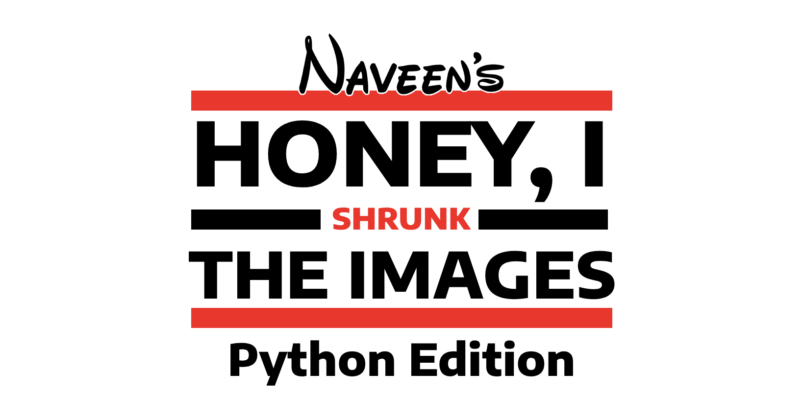

# Honey I shrunk the images - Python edition [](https://github.com/badges/stability-badges)

An experiment to shrink the size of the Python containers. We will take this step by step from simple programs to runnning CLI tools, APIs, and other interesting experiments.

This project relies on two python libraries to do what we want.

1. [Pyinstaller](https://www.pyinstaller.org/)
    a. Pyinstaller helps pack a python project into a distributable folder or a single binary
    b. The user will not need to have Python installed to run this binary
    c. However the app still will need certain system libraries
2. [StaticX](https://staticx.readthedocs.io/)
    a. StaticX helps pack all dynamic libraries statically with the binary we built with Pyinstaller
    b. However some run time loaded libraries may go missing. We will need to add them manually
    c. This can be done by trial and error or knowing what runtime dependency a library has

## Inspiration

The inspiration came from a casual conversation with by friend [@shibme](https://github.com/shibme). This [blog](https://medium.com/analytics-vidhya/dockerizing-a-rest-api-in-python-less-than-9-mb-and-based-on-scratch-image-ef0ee3ad3f0a) pointed me out to the right direction. And it deserves a lot of appreciation. Well its atleast good to know that I'm not the first one to try this experiment out.

The usage of distroless images was popularised over having least dependencies and reduced security risks. Building `FROM scratch` involves us to pack all the dependencies and libraries with the image. This is a tedious task and requires a lot of trial and error. But the end result is a very small image that can be used to run the application.

Applications written in languages like Go enjoys the freedom of running the resulting binary anywhere without any static linking. But Python is a dynamic language and requires a lot of libraries to run. This is where Pyinstaller and StaticX comes in.

## Downsides

Packing Python packages into a single binary will be slower than usual as it has to unpack itself before execution due to Python's nature. Sometimes the libraries loaded at runtime will not be packed with the executable. Which means we need to ensure that we add such libraries with the executable. Pyinstaller provides the ability to pack any data or binary with the executable. While StaticX allows you to link any libraries that may be missed by StaticX. This prevents us from having a standard template to build images. But I'm eager to try this.

## What this experiment will cover?

This experiment will look at the major challenges in packing python packages into binaries and run them in a Scratch container.

## What is Scratch in Docker?

Scratch is a Docker image that is used to build base or parent images. Or in Docker's words, `An explicitly empty image, especially for building images "FROM scratch".`

Although its present in Docker Hub we cannot pull and use it. It's basically a reserved keyword in Docker which says that it will be an empty image. You can check this by creating a Dockerfile like this.

```dockerfile
FROM scratch
```

Now run `docker build -t empty .` and `docker image ls`.
The result will look like this.

```sh
REPOSITORY                        TAG             IMAGE ID       CREATED        SIZE
empty                             latest          71de1148337f   N/A            0B
```

Let's look at the size of the base images we commonly use for python images.

```sh
REPOSITORY                        TAG             IMAGE ID       CREATED        SIZE
alpine                            latest          c059bfaa849c   4 days ago     5.59MB
python                            3.9-slim        3ba8c1c68e98   11 days ago    122MB
debian                            buster-slim     cad9ce16f840   12 days ago    69.3MB
debian                            bullseye-slim   66b2aecdb9f0   12 days ago    80.4MB
```

> Note: I don't yet recommend this build type for production. For now feel free to play with and see how we can improve this overtime.
